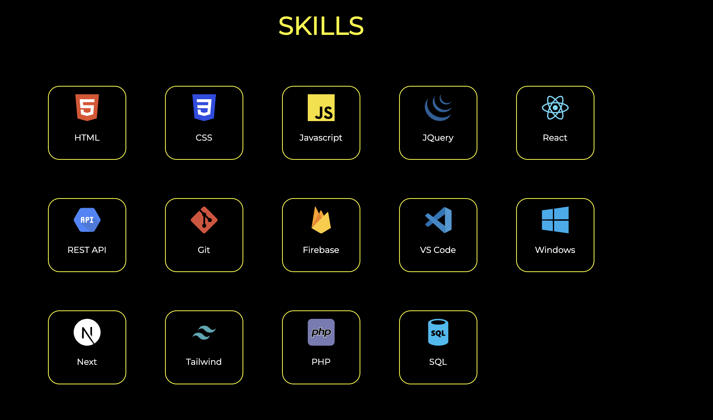

# System Design

## Colors and Fonts

### Colors
| ||
|--|--|--|
|`Hex: #FFFF00`|` Hex: #FFFFFF`|`Hex: #00000` |
|span, primary button and navbar background/outline | paragraphs, labels, headings | page background color, and navigation bar items|

### Fonts

<link href='https://fonts.googleapis.com/css?family=Montserrat' rel='stylesheet'>


 The only font used is  <span style="font-size:20px; font-family:Montserrat"> Montserrat</span> . It is a google font that can be added in the `<head>` tag 

```html
<head>
  ...
  <link href='https://fonts.googleapis.com/css?family=Montserrat' rel='stylesheet'>
  ...
</head>
```

## Header

A skeleton of the header is [available here](assets/header.html)


To align the logo image and the text description we created a ` <div class="description fade-in-element">` with the classname of description which is displayed as `flex` 

```html
<header>
    <div class="description fade-in-element">
        
        <div>
            <h6>Hi there ! </h6>
            <h3>I am <span>Mohamed Konate</span></h3>
            <h5>A <span>Software Engineer</span> passionate about creating interactive applications and experiences
                on the web.</h5>

            <div class="descriptionButtons">

                <a class="explore" href=#skills>Discover my world</a>
                <a class="resume" href=resume.html target="_blank">Resume</a>

            </div>
        </div>
    </div>
</header>
```

## Skills
A skeleton of the section is [available here](assets/skills.html)




We create a `div` element which is displayed as grid. Thus all the skills are added to this div as `li` elements. Every element is made of an image and a text `label`

```css
.skillsContainer{
    text-align: center;
    font-size: 0.7rem;
    border-color:#ffffff;
    border-radius: 50px;
    padding: 48px;
    
}

section {
    padding-bottom: 50px;
}

.skillsGrid {
    display: -ms-grid;
    display: grid;
    -ms-grid-columns: (minmax(80px, 1fr))[auto-fill];
    grid-template-columns: repeat(auto-fill, minmax(80px, 1fr));
    grid-column-gap: 50px;
    grid-row-gap: 50px;

}
.skillsGrid li {
    padding: 10px;
    border-radius: 15px;
    width: 80px;
    border: 1px solid #ffff00;
}

.skillsGrid li:hover {
    box-shadow: 2px 2px 50px yellow;
}
.skillsGrid li img {
    width: 35px;
    height: 35px;
}
```